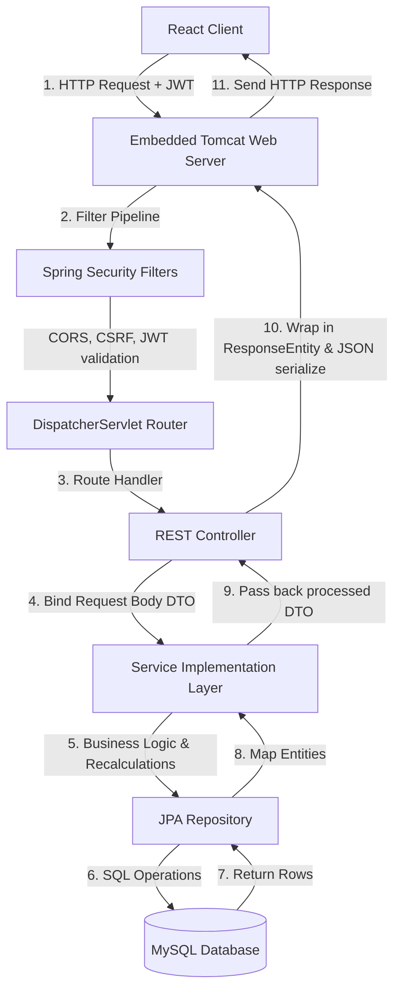

# ☕ EventHub Spring Boot Backend Guide

This guide provides a comprehensive, detailed breakdown of the Spring Boot backend architecture, packages, security systems, database designs, and business logic implementation of the EventHub system.

---

## 📂 1. Directory & Package Structure

The backend application follows a standard **layered enterprise architecture**. Each layer has a single, dedicated responsibility.

```
backend/src/main/java/com/eventplatform/
│
├── 🚀 EventPlatformApplication.java   # App entry point (starts Tomcat & Spring Context)
│
├── 🏛️ config/                         # Configuration Beans
│   └── DatabaseSeeder.java            # CommandLineRunner to populate default roles/users/events
│
├── 🚪 controller/                     # REST Controllers (API Endpoints & HTTP Request Routing)
│   ├── AdminController.java           # Admin metrics and dashboard APIs
│   ├── AuthController.java            # Sign-up and login endpoints
│   ├── EventController.java           # Public and private Event CRUD
│   ├── PaymentController.java         # Razorpay checkout & signature validation
│   └── RegistrationController.java    # Bookings and seat selections
│
├── 📦 dto/                            # Data Transfer Objects (Custom request/response containers)
│   ├── AdminStatsResponse.java        # Stats counts dashboard payload
│   ├── AuthResponse.java              # JWT Token + User profile return payload
│   ├── LoginRequest.java              # Login email/password payload
│   ├── PaymentRequest.java            # Razorpay verification details
│   └── RegisterRequest.java           # Registration email/name/password payload
│
├── 🗄️ entity/                         # JPA Entities (Database Table Mappings)
│   ├── Event.java                     # Event metadata, capacity & seating layout configurations
│   ├── Payment.java                   # Razorpay transaction states & amounts
│   ├── Registration.java              # Booking records, seats coordinates, and statuses
│   ├── Role.java                      # Security authorities (ROLE_USER, ROLE_ADMIN)
│   └── User.java                      # Profile metadata, passwords, and assigned roles
│
├── 💾 repository/                     # Database Repository Layer (JPA / SQL Queries)
│   ├── EventRepository.java           # Event searches and existence checks
│   ├── PaymentRepository.java         # Transaction order lookups
│   ├── RegistrationRepository.java    # User booking histories and statistics
│   ├── RoleRepository.java            # Role name queries
│   └── UserRepository.java            # Email existence and profile lookups
│
├── 🔐 security/                       # Spring Security & JWT components
│   ├── CustomUserDetailsService.java  # Loads User details from database during auth
│   ├── JwtAuthenticationFilter.java   # Intercepts requests to parse & validate JWT headers
│   ├── JwtTokenProvider.java          # Utility to issue, validate, and parse JWT strings
│   └── SecurityConfig.java            # Configures filter chains, CORS, CSRF, and authorization rules
│
├── ⚙️ service/                        # Service Implementation Layer (Business & Transaction Logic)
│   ├── AdminStatsService.java         # Service to compile dashboard analytics
│   ├── AuthService.java               # Service to sign up users and issue login tokens
│   ├── EventService.java              # Service for event records modifications
│   ├── PaymentService.java            # Service to interface with Razorpay and verify signatures
│   └── RegistrationService.java       # Service to book seats, enforce constraints, and cancel passes
│
└── 🔧 util/                           # Helper Utilities
    └── QrCodeGenerator.java           # Google ZXing engine to generate Base64 QR ticket codes
```

---

## 🗄️ 2. JPA Database Layer (`com.eventplatform.entity` & `repository`)

We use **Java Persistence API (JPA)** with **Hibernate** to automatically build database tables.

### Key Annotations Explained:
*   `@Entity`: Marks a Java class as a table map.
*   `@Table(name="...")`: Defines the specific database table name.
*   `@Id` & `@GeneratedValue`: Declares a field as the Primary Key and sets its generation policy (e.g. `IDENTITY` maps to MySQL `AUTO_INCREMENT`).
*   `@Column(nullable=false, unique=true)`: Sets constraints like `NOT NULL` and `UNIQUE` on the database column.
*   `@ManyToMany`, `@ManyToOne`, `@OneToOne`: Establishes SQL table relationships.
*   `@JoinColumn(name="...")`: Explicitly defines the Foreign Key column name.

### Repository Layer:
Our repositories extend `JpaRepository<Entity, ID>`. 
*   **Dynamic Queries**: Spring automatically generates SQL queries from method names (e.g., `existsByEmail(String email)` will write the appropriate SQL query implicitly).
*   **Custom JPQL**: In `EventRepository.java`, we use the `@Query` annotation with **Java Persistence Query Language** to implement a combined text search and category filter query:
    ```java
    @Query("SELECT e FROM Event e WHERE " +
           "(LOWER(e.title) LIKE LOWER(CONCAT('%', :search, '%')) OR " +
           " LOWER(e.description) LIKE LOWER(CONCAT('%', :search, '%'))) AND " +
           "(:category = 'All' OR e.category = :category)")
    ```

---

## 🔐 3. Spring Security & JWT Architecture

Spring Security intercepts all incoming REST API requests using a **Filter Chain** before they reach the Controllers.

```
[Inbound Request] ──> [CORS/CSRF Filters] ──> [JwtAuthenticationFilter] ──> [Controller Endpoints]
                                                        │
                                          Loads JWT from Authorization Header
                                                        │
                                          Checks Token Signature & Expiry
                                                        │
                                     Injects Authorities into SecurityContext
```

### Core Security Configuration (`SecurityConfig.java`):
*   **CORS**: Configures Cross-Origin Resource Sharing to allow your React frontend running on port `5173` to safely connect to the backend on port `8080`.
*   **CSRF**: Disabled, since we use custom stateless JWT headers rather than session cookies.
*   **Stateless Session**: Configured as `SessionCreationPolicy.STATELESS`. Spring Boot will not maintain session state on the server.
*   **Endpoint Authorization Rules**:
    *   `/api/auth/**`, `/api/events/**` (GET Only) ➔ **Permit All** (Public).
    *   `/api/admin/**` ➔ Restricts access to users holding the **`ROLE_ADMIN`** authority.
    *   All other routes (e.g., booking, payments) ➔ Requires authentication.

### Token Management (`JwtTokenProvider.java`):
Generates cryptographic tokens containing user details (subject = email, claims = roles) using a secret signature key.
*   **Expiration**: Set to 24 hours (`86400000ms`).
*   **Bcrypt Password Encoder**: Registered as a Spring Bean to cryptographically hash passwords using a one-way salt before database storage.

---

## 💳 4. Service Layer & Business Logic

Services contain the transactional core of the project.

### Seating Layout Presets & VIP Pricing (`PaymentServiceImpl.java`):
*   **VIP seats**: Defined as Row A and Row B seats under the `VIP_FRONT` seating layout preset.
*   **Price Recalculation (Anti-Tampering)**: Calculates pricing on both order creation and payment callback signature validation to ensure the client has not modified the pricing parameters:
    ```java
    public double calculateRegistrationPrice(Registration reg) {
        String seats = reg.getSeats();
        double basePrice = reg.getEvent().getPrice();
        String layout = reg.getEvent().getSeatingLayout();
        
        if (seats == null || seats.trim().isEmpty()) return 0.0;
        String[] seatArray = seats.split(",");
        double total = 0.0;
        
        for (String seat : seatArray) {
            String cleanSeat = seat.trim();
            // Checking if Row is A or B (VIP seats are Row A & B under VIP_FRONT layout)
            boolean isVip = "VIP_FRONT".equalsIgnoreCase(layout) && 
                            (cleanSeat.charAt(0) - 'A' < 2);
            total += isVip ? (basePrice * 1.5) : basePrice;
        }
        return total;
    }
    ```

### Razorpay Integration & Signature Verification:
1.  **Order Generation**: Creates a transaction order on Razorpay using the SDK, returning a unique `order_id` back to the frontend.
2.  **Signature Verification**: Receives `razorpayOrderId`, `razorpayPaymentId`, and `razorpaySignature` from the client on payment completion.
3.  **Cryptographic Verification**: Generates a signature hash using the HMAC-SHA256 algorithm:
    ```java
    String generatedSignature = HMAC_SHA256(orderId + "|" + paymentId, secretKey);
    boolean isValid = generatedSignature.equals(signature);
    ```
    If valid, the system marks the payment status as `SUCCESS` and the registration status as `CONFIRMED`.

---

## ⚙️ 5. Utility Layer: QR Code Generator (`QrCodeGenerator.java`)

To avoid generating physical QR image files on the server (which uses storage space), our utility generates code data dynamically:
1.  Uses the **Google ZXing library** to encode the ticket's booking registration number into a 2D matrix.
2.  Converts the matrix bytes into a PNG image format in memory.
3.  Converts the image bytes into a **Base64 String** and returns it:
    ```java
    byte[] pngData = MatrixToImageWriter.toBufferedImage(bitMatrix);
    String base64 = Base64.getEncoder().encodeToString(pngData);
    ```
4.  React simply renders this string in an `` tag:
    `src={`data:image/png;base64,${qrCodeBase64}`}`

---

## 🔄 6. Spring Boot Request Lifecycle Flow

Here is the step-by-step lifecycle of how the Spring Boot backend processes any incoming request (e.g. `POST /api/registrations` to book seats):



### Flow Details:
1. **Tomcat Web Server**: Listens on port 8080. Parses raw incoming HTTP byte streams into Java `HttpServletRequest` objects.
2. **Spring Security Filter Chain**:
   * **CORS Filter**: Validates that requests come from the trusted React dev client origin (`http://localhost:5173`).
   * **JWT Filter**: Extracts `Authorization` headers, validates token signatures using the system secret, and loads roles/permissions.
3. **DispatcherServlet Router**: Acting as a front controller, it determines which `@RestController` maps to the request URL and calls it.
4. **Controller Layer**: Parses the incoming JSON body into an input DTO using Jackson. Invokes security authority validations.
5. **Service Layer**: Handles core business logic (e.g. seat validation, pricing recalculation, Razorpay integration).
6. **Repository Layer (JPA/Hibernate)**: Translates transactional operations into SQL queries and executes them against MySQL via JDBC.
7. **Response Serialization**: The controller receives the service result, wraps it in a `ResponseEntity`, Jackson converts the Java object back to a JSON string, and Tomcat writes it to the output socket.
