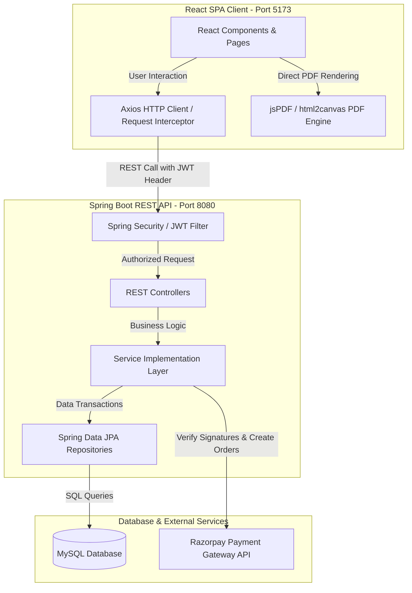
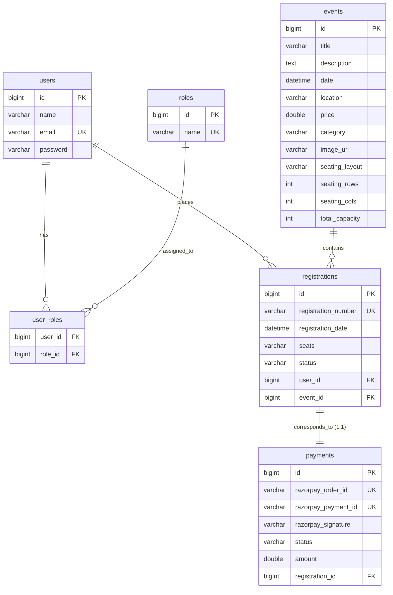

# 🎓 EventHub Project Study & Exam Guide

Welcome to the comprehensive guide for the **EventHub Event Management & Ticket Booking System**. This document is designed to help you understand the architecture, database schema, design patterns, and deep data flow mechanisms of the project to help you confidently explain the project for your exam.

---

## 🗺️ 1. System Architecture

EventHub is a modern fullstack web application built using a **decoupled Client-Server architecture**. The frontend and backend run as separate applications communicating over stateless HTTP REST APIs.



### 💻 Technology Stack Details:
1. **Frontend**:
   * **Vite + React (SPA)**: Ultra-fast compilation and client-side single-page routing (`react-router-dom`).
   * **Tailwind CSS**: Modern CSS styling with interactive utility states.
   * **Axios**: Configured with a central interceptor to attach JWT tokens to the `Authorization` header of every outbound request.
2. **Backend**:
   * **Spring Boot**: REST API core, running with DevTools for automatic reloading.
   * **Spring Security & JJWT (Java JWT)**: Custom stateless filter for token parsing, role validation, and resource access control.
   * **Spring Data JPA & Hibernate**: Object-Relational Mapping (ORM) to auto-generate tables, map relationships, and run custom JPQL queries.
3. **Database & Payments**:
   * **MySQL**: Storage engine for users, roles, events, bookings, and transaction stats.
   * **Razorpay Gateway**: Integrated checkouts with secure backend signature validation.

---

## 🗄️ 2. Database Schema Design (MySQL)

Hibernate automatically maps JPA entity definitions to the database schema. We have **5 main tables** and **1 junction table** mapping relationships:



### 🤝 Relationship Constraints:
* **User ↔ Role (Many-to-Many)**: A user can have multiple roles (e.g. `ROLE_USER`, `ROLE_ADMIN`), and roles belong to many users. Managed via junction table `user_roles`.
* **User ↔ Registration (One-to-Many)**: A user can book multiple tickets, but each registration belongs to exactly one user.
* **Event ↔ Registration (One-to-Many)**: An event can have multiple ticket registrations, but each registration links to one specific event.
* **Registration ↔ Payment (One-to-One)**: A ticket registration corresponds to exactly one Razorpay payment transaction.

---

## 🔄 3. Deep-Dive Data Flows

### Flow A: Stateless Authentication & Security (Login / Register)

When a user logs in, the authentication flow behaves as follows:

```
[React SPA]                                         [Spring Boot Controller]                      [MySQL DB]
    |                                                           |                                     |
    |---- 1. POST /api/auth/login (email, password) ----------->|                                     |
    |                                                           |---- 2. Find User by email --------->|
    |                                                           |<--- 3. Return User with Password ---|
    |                                                           |                                     |
    |                                                           |-- 4. Bcrypt verify passwords match -|
    |                                                           |-- 5. Generate JJWT Token (claims) --|
    |                                                           |                                     |
    |<--- 6. Return JWT Token + User profile details -----------|                                     |
    |                                                           |                                     |
    |-- 7. Save JWT in localStorage ----------------------------|                                     |
    |-- 8. Save User Info in localStorage ----------------------|                                     |
    |                                                           |                                     |
```

* **Axios Request Interceptor**: For all future API calls, Axios reads the JWT from `localStorage` and automatically appends it to the header:
  `headers.Authorization = "Bearer <token>"`
* **JWT Validation**: On the server, `JwtAuthenticationFilter` intercepts the request, extracts the token, parses the user email and roles, and injects them into the Spring Security Context (`SecurityContextHolder`).

---

### Flow B: Interactive Seating Selection, Pricing, & Booking Flow

This is the most critical workflow in the application, involving frontend seat grids, dynamic calculations, and transactional payments:

```
[React Modal]                [Spring Controller]              [PaymentServiceImpl]                [Razorpay API]
      |                               |                                |                                 |
      |-- 1. Click seats ------------|                                |                                 |
      |-- 2. VIP Pricing (1.5x) ------|                                |                                 |
      |-- 3. Click "Pay Now" --------|                                |                                 |
      |                               |                                |                                 |
      |-- 4. POST /api/registrations (seats, eventId) --------------->|                                 |
      |                               |                               |-- 5. Recalculate price --------|
      |                               |                               |   (Verify VIP seats 1.5x)       |
      |                               |                               |                                 |
      |                               |                               |-- 6. Create Razorpay Order ---->|
      |                               |                               |<-- 7. Return Order details -----|
      |                               |                                |                                 |
      |                               |                               |-- 8. Save Registration (PENDING)|
      |                               |                               |-- 9. Save Payment (PENDING) ----|
      |                               |                                |                                 |
      |<-- 10. Return Order details & Registration info --------------|                                 |
      |                               |                                |                                 |
      |-- 11. Open Razorpay Modal ----|                                |                                 |
      |-- 12. Enter payment info -----|                                |                                 |
      |<-- 13. Return Signature ------|                                |                                 |
      |                               |                                |                                 |
      |-- 14. POST /payments/verify --------------------------------->|                                 |
      |   (Signature, Order ID, Payment ID)                            |-- 15. Verify Signature SHA-256 -|
      |                               |                                |   (Key Secret + Order ID)       |
      |                               |                                |                                 |
      |                               |                                |-- 16. Update Reg Status (CONFIRMED)
      |                               |                                |-- 17. Update Pay Status (SUCCESS)
      |                               |                                |                                 |
      |<-- 18. Return Success payload ---------------------------------|                                 |
      |                               |                                |                                 |
      |-- 19. Dynamically Render pass |                                |                                 |
      |-- 20. Direct PDF download ----|                                |                                 |
```

1. **Seating Layout Rendering**: The client reads the event's `seatingLayout` (e.g. `VIP_FRONT`, `CENTER_AISLE`, `STANDARD`) and parameters (`seatingRows`, `seatingCols`).
2. **Walkway Spacers**: If the layout is `CENTER_AISLE`, a clean spacing column (`w-6 md:w-8`) is inserted at the center of the columns index without disrupting button numbers.
3. **Seating Categories & Multipliers**:
   * **VIP Seats**: Defined as Rows A and B (first 2 rows) under the `VIP_FRONT` seating preset.
   * **Price Multiplier**: VIP seats calculate pricing at **`1.5x`** the base price.
4. **Backend Anti-Tamper Pricing Protection**: The server recalculates seat totals inside `calculateRegistrationPrice(Registration)` in `PaymentServiceImpl.java` using coordinate row offsets to ensure the client has not tampered with pricing parameters.
5. **Razorpay Signature verification**: In `verifyPayment`, the server hashes `orderId + paymentId` using HMAC-SHA256 and the system's private API Secret. It compares this hash with the `razorpaySignature` sent by the client. If they match, the transaction is marked authentic and successful.

---

### Flow C: Admin Management Flow (Create / Edit Events)

```
[React Admin Page]                               [Spring Controller]                             [MySQL DB]
        |                                                 |                                          |
        |---- 1. Submit Event Form (seating layout, etc)-->|                                          |
        |                                                 |---- 2. JPA save() event entity ----------->|
        |                                                 |<--- 3. Return updated event database record|
        |<--- 4. Refresh stats and UI event state --------|                                          |
```

* **Category Alignment**: The category input fields are normalized to **`Tech`**, `Design`, and `Music` to correspond to category filters.
* **Fields Update Mapping**: The backend JPA mapping explicitly links the layout properties (`seatingLayout`, `seatingRows`, `seatingCols`, `totalCapacity`) so they update in database records during event editing.

---

## 📱 4. Key UX & Mobile Responsiveness Optimizations

1. **Floating Glassmorphic Navbar**: 
   A floating header centered at the top (`sticky top-4 w-[98%] max-w-6xl mx-auto rounded-2xl bg-white/85 shadow-md backdrop-blur-md z-50`). Includes desktop slide-out underlines on nav link hovers and a rotating brand vector ticket icon.
2. **Smooth Page-Load Transitions**:
   Attached the custom `.animate-fade-in-up` class to the outer container of every page. Leverages a cubic-bezier curve (`cubic-bezier(0.16, 1, 0.3, 1)`) to fade and slide navigation panels upwards on page load.
3. **Centered Overlay Centering**:
   Configured the seat selection overlay with `flex items-center justify-center` and margins `mx-auto my-auto`.
4. **Mobile Scroll & Divider fixes**:
   * **CSS Centering Bug Resolved**: Switched the seating grid container on mobile from `items-center justify-center` to `items-start justify-start` to avoid the browser negative-coordinate clipping bug. Added horizontal scrollbars to mobile views so users can swipe through wide layouts cleanly.
   * **Nested Scroll Traps Removed**: Set the grid container to `overflow-y-visible` on mobile. This lets the parent modal card handle vertical scrolling naturally, preventing swiping issues.
   * **Overlapping Divider Resolved**: Swapped the right panel's `border-t` with a dedicated, margin-safe horizontal line (`<hr>`) to avoid overlap with legend widgets on small viewports.
5. **Direct Background PDF Generation**:
   Dynamically loads `html2canvas` and `jsPDF` scripts via CDN on click. It builds a high-quality ticket canvas off-screen, takes a vector snapshot, compiles an landscape PDF file, and downloads it directly to user devices. This prevents pop-up blocking and stuck printer previews on mobile.

---

## ❓ 5. Viva / Exam Preparation Questions & Answers

### Q1: What is the overall architecture of this application?
> **Answer**: It is a decoupled, single-page application (SPA) client-server architecture. The frontend is built on Vite, React, and Tailwind CSS. The backend is built using Spring Boot, Spring Security, and Hibernate JPA. Communication occurs through stateless REST API calls using JSON payload structures.

### Q2: How does authentication and route authorization work?
> **Answer**: We use stateless role-based authentication with **JWT (JSON Web Tokens)**:
> 1. The client registers or logs in via `/api/auth/login`.
> 2. The server verifies the password using BCrypt and returns a JWT containing user claims (email, roles).
> 3. The client saves this token in `localStorage`.
> 4. For every API request, an Axios request interceptor attaches the token as `Authorization: Bearer <token>`.
> 5. A custom security filter (`JwtAuthenticationFilter`) on the server reads the header, validates the signature, extracts permissions, and registers the user in Spring's Security context.

### Q3: Why is CSRF disabled in the Spring Boot configuration?
> **Answer**: CSRF protection is necessary for cookie-based session architectures where browsers automatically attach session IDs to requests. Because our API is completely stateless and uses custom **JWT Authorization Headers** stored in `localStorage`, the browser does not attach credentials automatically. Consequently, cross-origin scripts cannot forge requests, protecting the API against CSRF naturally.

### Q4: How is database access handled, and how does the database seed data?
> **Answer**: Database access is managed using **Spring Data JPA** repositories extending `JpaRepository`. At startup, the `DatabaseSeeder` component implements Spring's `CommandLineRunner` interface. It checks if the default roles (`ROLE_USER`, `ROLE_ADMIN`), administrator accounts, and sample events exist. If missing, it saves them using Hibernate ORM methods.

### Q5: How did you implement seat selection layouts and dynamic VIP pricing?
> **Answer**: 
> * **Seat Grid**: Generated dynamically using row characters (`A, B, C...`) and column indices. The grid renders visual walkway breaks if the layout is set to `CENTER_AISLE`.
> * **VIP Rules**: Seats in Rows A and B under a `VIP_FRONT` layout are flagged as VIP seats.
> * **VIP Pricing**: Calculated dynamically at **`1.5x`** the base price.
> * **Price Protection**: On registration requests, the backend recalculates pricing in the service layer using coordinate indexes to verify that payment amounts match the expected VIP and standard seat totals, preventing price tampering.

### Q6: How does Razorpay payment integration work safely?
> **Answer**:
> 1. The backend service layer creates a transactional order with the Razorpay API using our API Key ID and Secret.
> 2. Razorpay returns an `order_id` which is saved to our local database.
> 3. The frontend displays the checkout form using the Razorpay SDK.
> 4. Once payment completes, the SDK returns a transaction signature.
> 5. The backend validates this signature by calculating an HMAC-SHA256 hash using the local API secret, the `order_id`, and the `payment_id`. If it matches the signature, the registration is updated to `CONFIRMED`.

### Q7: How does the PDF ticket generation work on mobile devices?
> **Answer**: Since mobile browsers block pop-ups and often freeze on `window.print()` calls due to print subsystem constraints, we implemented a background PDF engine. The application dynamically imports `html2canvas` and `jsPDF` via CDN scripts when the user clicks "Print Pass". It constructs a ticket element off-screen, takes a canvas snapshot, outputs a landscape PDF file, and triggers a direct browser download.
